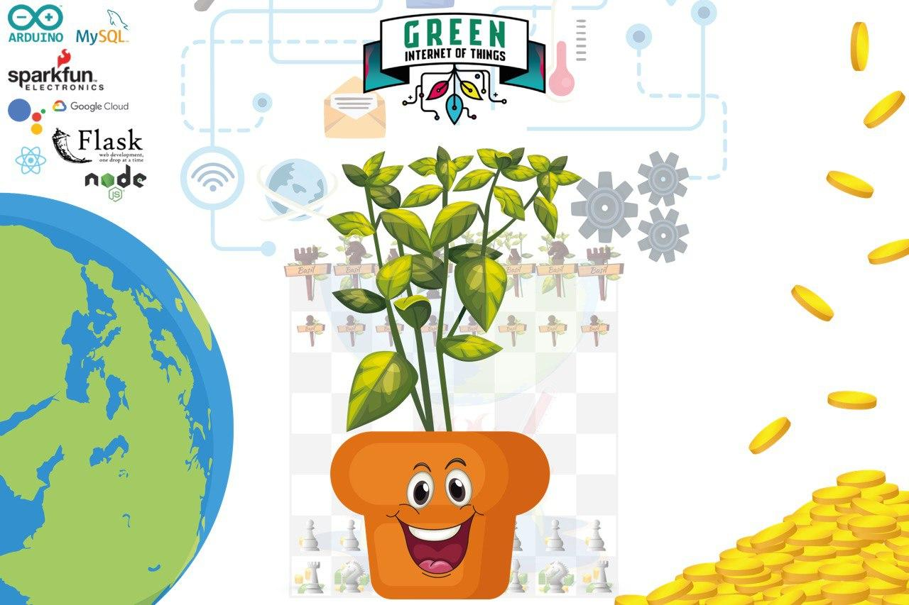

= Plantbridge

A Game of Chess between the Stock Market and a Basil Plant. Our basil controls one agent of a chess game against capitalistic exploitation by influencing the solver's heuristic using IoT technology.

